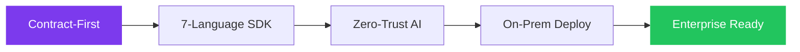
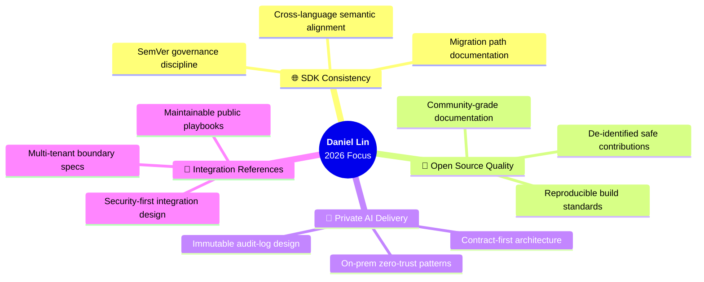

<!-- ██████████████████████████████████████████████████████████████████
     DANIEL LIN · GitHub Profile README · 2026 International Edition
     ──────────────────────────────────────────────────────────────────
     Design System  : Bento Grid · Spatial Dark · Aurora Violet
     Story Arc      : Pixar Hook → Evidence Chain → 3-Path CTA
     Brand Voice    : Precision Engineering meets Calm Confidence
     Audience       : Global Enterprise Buyers · OSS Community · Devs
     Render Tested  : GitHub Dark ✓  GitHub Light ✓  Mobile ✓
██████████████████████████████████████████████████████████████████ -->

<!-- ══════════════════════════════════════════════════════════════════
                         LANGUAGE NAVIGATION
══════════════════════════════════════════════════════════════════ -->

<div align="right">

<a href="#english-version">🇺🇸 English</a> &nbsp;|&nbsp; <a href="#chinese-version">🇹🇼 繁體中文</a>

</div>

<!-- ══════════════════════════════════════════════════════════════════
     █  SCENE 01 · HERO  ─  "Who is this person in 3 seconds?"
══════════════════════════════════════════════════════════════════ -->

<a id="english-version"></a>

<div align="center">


</div>

<div align="center">


</div>

<br/>

<!-- ── STATUS BADGES ──────────────────────────────────────────────── -->

<div align="center">

[](https://github.com/a6091731)&nbsp;
[](https://github.com/a6091731?tab=followers)&nbsp;
[](https://github.com/a6091731)&nbsp;
[](https://github.com/eGroupAI)&nbsp;
[](https://github.com/a6091731)&nbsp;
[](https://github.com/a6091731)

</div>

<br/>

---

<!-- ══════════════════════════════════════════════════════════════════
     █  SCENE 02 · IMPACT  ─  "Numbers that prove the mission"
══════════════════════════════════════════════════════════════════ -->

## ⚡ &nbsp;Impact at a Glance

<div align="center">

<table width="96%" border="0" cellspacing="6" cellpadding="0">
<tr align="center">

<td width="20%" style="padding:12px">
<br/>
<sub>SDK Program Coverage</sub>
</td>

<td width="20%" style="padding:12px">
<br/>
<sub>Contract-First Design</sub>
</td>

<td width="20%" style="padding:12px">
<br/>
<sub>Security Architecture</sub>
</td>

<td width="20%" style="padding:12px">
<br/>
<sub>CI/CD Automation Cycle</sub>
</td>

<td width="20%" style="padding:12px">
<br/>
<sub>Private Deployment Stack</sub>
</td>

</tr>
</table>

</div>

<br/>

---

<!-- ══════════════════════════════════════════════════════════════════
     █  SCENE 03 · MISSION  ─  "The story in one paragraph"
══════════════════════════════════════════════════════════════════ -->

<table width="100%" border="0" cellspacing="0" cellpadding="0">
<tr valign="top">

<td width="56%">

## 🧭 &nbsp;Mission

> *"Every great integration starts with a contract —*  
> *a promise between systems that survives production."*

Building **on-prem and private AI** that enterprises can actually deploy,  
audit, and trust — without sacrificing developer experience.

<br/>

**What I bridge:**

```
  Product Vision  ──▶  Engineering Reality  ──▶  GTM Clarity
       🏗️                     🔧                      🚀
```

**How I deliver:**

| Layer | Method |
|:---|:---|
| 🔗 SDK Contract | OpenAPI-first, schema-validated |
| 🔄 CI / CD | Automated boundary checks at every gate |
| 🛡️ Security | Review before every public surface update |
| 📦 Release | Semantic versioning + migration discipline |

</td>

<td width="2%"></td>

<td width="42%">

## 📊 &nbsp;Capability Spectrum

```
  SDK Engineering    ▓▓▓▓▓▓▓▓▓▓▓▓░  95%
  CI/CD Governance   ▓▓▓▓▓▓▓▓▓▓▓░░  85%
  Product Liaison    ▓▓▓▓▓▓▓▓▓▓░░░  80%
  Security Review    ▓▓▓▓▓▓▓▓▓░░░░  75%
  GTM Execution      ▓▓▓▓▓▓▓▓░░░░░  65%
  Open Source        ▓▓▓▓▓▓░░░░░░░  55%
```

<br/>

**Active Focus 2026:**



</td>

</tr>
</table>

<br/>

---

<!-- ══════════════════════════════════════════════════════════════════
     █  SCENE 04 · SDK PROGRAM  ─  "The product grid"
══════════════════════════════════════════════════════════════════ -->

## 🌐 &nbsp;Multi-Language SDK Program

<div align="center">

*One contract spec. Seven runtime targets. Zero compromise on consistency.*

<br/>

<table width="98%" border="0" cellspacing="4">
<tr align="center">

<td width="14%">
<a href="https://github.com/eGroupAI/ai-sandbox-sdk-typescript" title="TypeScript SDK">
<br/>
<sub><b>TypeScript</b></sub><br/>

</a>
</td>

<td width="14%">
<a href="https://github.com/eGroupAI/ai-sandbox-sdk-python" title="Python SDK">
<br/>
<sub><b>Python</b></sub><br/>

</a>
</td>

<td width="14%">
<a href="https://github.com/eGroupAI/ai-sandbox-sdk-go" title="Go SDK">
<br/>
<sub><b>Go</b></sub><br/>

</a>
</td>

<td width="14%">
<a href="https://github.com/eGroupAI/ai-sandbox-sdk-java" title="Java SDK">
<br/>
<sub><b>Java</b></sub><br/>

</a>
</td>

<td width="14%">
<a href="https://github.com/eGroupAI/ai-sandbox-sdk-csharp" title="C# SDK">
<br/>
<sub><b>C#</b></sub><br/>

</a>
</td>

<td width="14%">
<a href="https://github.com/eGroupAI/ai-sandbox-sdk-php" title="PHP SDK">
<br/>
<sub><b>PHP</b></sub><br/>

</a>
</td>

<td width="14%">
<a href="https://github.com/eGroupAI/ai-sandbox-sdk-ruby" title="Ruby SDK">
<br/>
<sub><b>Ruby</b></sub><br/>

</a>
</td>

</tr>
</table>

<br/>

| 🌍 Language Coverage | 📐 Design Pattern | 🔄 Consistency | 🔐 Security Gate | 📦 Versioning |
|:---:|:---:|:---:|:---:|:---:|
| **7 Languages** | **Contract-First** | **Cross-Aligned** | **Release Gate** | **SemVer** |

</div>

<br/>

---

<!-- ══════════════════════════════════════════════════════════════════
     █  SCENE 05 · ANALYTICS  ─  "The data that speaks"
══════════════════════════════════════════════════════════════════ -->

## 📈 &nbsp;GitHub Analytics

<div align="center">

&nbsp;&nbsp;

<br/><br/>


</div>

<br/>

---

<!-- ══════════════════════════════════════════════════════════════════
     █  SCENE 06 · PROOF  ─  "Trophies & reliability scorecard"
══════════════════════════════════════════════════════════════════ -->

## 🏆 &nbsp;Achievement Wall

<div align="center">


</div>

<br/>

## 🎯 &nbsp;Reliability Scorecard

<div align="center">

<table width="94%">
<thead>
<tr>
<th align="center" width="18%">Signal</th>
<th align="left" width="44%">Engineering Practice</th>
<th align="center" width="20%">Grade</th>
<th align="center" width="18%">Status</th>
</tr>
</thead>
<tbody>
<tr>
<td align="center">🔗 <b>API Contract</b></td>
<td>OpenAPI-first schema with SDK generation pipeline</td>
<td align="center"></td>
<td align="center">✅ Live</td>
</tr>
<tr>
<td align="center">🔄 <b>CI / CD</b></td>
<td>Automated release governance, boundary validation at gate</td>
<td align="center"></td>
<td align="center">✅ Live</td>
</tr>
<tr>
<td align="center">🛡️ <b>Security</b></td>
<td>Review-gated publishing for all outward-facing surfaces</td>
<td align="center"></td>
<td align="center">✅ Live</td>
</tr>
<tr>
<td align="center">📦 <b>Release</b></td>
<td>Semantic versioning with breaking-change migration guides</td>
<td align="center"></td>
<td align="center">✅ Live</td>
</tr>
<tr>
<td align="center">📚 <b>Docs</b></td>
<td>Public integration references without internal data leakage</td>
<td align="center"></td>
<td align="center">✅ Live</td>
</tr>
</tbody>
</table>

</div>

<br/>

---

<!-- ══════════════════════════════════════════════════════════════════
     █  SCENE 07 · FOCUS  ─  "2026 strategic direction"
══════════════════════════════════════════════════════════════════ -->

## 🔭 &nbsp;2026 Strategic Focus



<br/>

---

<!-- ══════════════════════════════════════════════════════════════════
     █  SCENE 08 · TRUST  ─  "The disclosure boundary"
══════════════════════════════════════════════════════════════════ -->

## 🔒 &nbsp;Public Disclosure Boundary

<table width="100%" border="0" cellspacing="0">
<tr valign="top">

<td width="48%" align="center">

### ✅ &nbsp;What This Profile Shares

<br/>

| # | Public Signal |
|:---:|:---|
| `01` | 📦 SDK & API engineering evidence |
| `02` | 📊 De-identified technical outcomes |
| `03` | 🚦 Release-quality cadence signals |
| `04` | 📖 Integration patterns & playbooks |
| `05` | 🧪 Process-level delivery discipline |

<br/>


</td>

<td width="4%"></td>

<td width="48%" align="center">

### 🔐 &nbsp;What This Profile Does NOT Share

<br/>

| # | Protected Asset |
|:---:|:---|
| `01` | 🏗️ Proprietary architecture internals |
| `02` | 🤖 Private endpoints, prompts, models |
| `03` | 👤 Customer-identifying information |
| `04` | 📉 Raw internal KPI numbers |
| `05` | 🔑 Credentials or infra identifiers |

<br/>


</td>

</tr>
</table>

<br/>

---

<!-- ══════════════════════════════════════════════════════════════════
     █  SCENE 09 · ACTIVITY  ─  "Live contribution signals"
══════════════════════════════════════════════════════════════════ -->

## 🐍 &nbsp;Contribution Activity

<div align="center">

<picture>
  <source media="(prefers-color-scheme: dark)"  srcset="https://raw.githubusercontent.com/a6091731/a6091731/output/github-contribution-grid-snake-dark.svg" />
  <source media="(prefers-color-scheme: light)" srcset="https://raw.githubusercontent.com/a6091731/a6091731/output/github-contribution-grid-snake.svg" />
  
</picture>

</div>

<br/>

## 📅 &nbsp;Contribution Flow

<div align="center">


</div>

<br/>

---

<!-- ══════════════════════════════════════════════════════════════════
     █  SCENE 10 · STACK  ─  "The tools of the trade"
══════════════════════════════════════════════════════════════════ -->

## 🛠️ &nbsp;Tech Stack

<div align="center">

**SDK Languages**

&nbsp;
&nbsp;
&nbsp;
&nbsp;
&nbsp;
&nbsp;


**Platform & DevOps**

&nbsp;
&nbsp;
&nbsp;


**Private AI Domain**

&nbsp;
&nbsp;
&nbsp;


</div>

<br/>

---

<!-- ══════════════════════════════════════════════════════════════════
     █  SCENE 11 · SHOWCASE  ─  "The pinned proof"
══════════════════════════════════════════════════════════════════ -->

## 🌟 &nbsp;Public Showcase

<div align="center">

[](https://github.com/a6091731/ai-sandbox-public-showcase)

*Sanitized capability map &nbsp;·&nbsp; Security boundary &nbsp;·&nbsp; Integration playbooks*

</div>

<br/>

---

<!-- ══════════════════════════════════════════════════════════════════
     █  SCENE 12 · CTA  ─  "3-path conversion — the GTM gate"
══════════════════════════════════════════════════════════════════ -->

## 🤝 &nbsp;Work With This Profile

<div align="center">

<table width="90%" border="0" cellspacing="8">
<tr align="center">

<td width="33%" valign="top">

### 🏢 &nbsp;Enterprise / Business

*Evaluating Private AI deployment or SDK integration for your organization?*

<br/>

[](https://github.com/a6091731/ai-sandbox-public-showcase)

<br/>
<sub>Security boundaries · Playbooks · Integration standards</sub>

</td>

<td width="33%" valign="top">

### 🌱 &nbsp;Open Source / Community

*Want to contribute, review, or build on the SDK program?*

<br/>

[](https://github.com/eGroupAI)

<br/>
<sub>7 languages · Issues welcome · Contract-first design</sub>

</td>

<td width="33%" valign="top">

### 🔧 &nbsp;Developer / Integrator

*Building on AI Sandbox APIs? Start with the TypeScript reference.*

<br/>

[](https://github.com/eGroupAI/ai-sandbox-sdk-typescript)

<br/>
<sub>TypeScript · OpenAPI schema · Migration guides</sub>

</td>

</tr>
</table>

</div>

<br/>

---

<!-- ══════════════════════════════════════════════════════════════════
     █  CHINESE VERSION  ─  同等內容，繁體中文版
══════════════════════════════════════════════════════════════════ -->

<a id="chinese-version"></a>

<details>
<summary><b>🇹🇼 &nbsp;繁體中文版 — 展開閱讀</b></summary>

<br/>

## 🧭 &nbsp;使命

> *「每一個偉大的整合，始於一份合約 —— 一個在生產環境中依然有效的系統承諾。」*

專注於建構企業可部署、可稽核、可信賴的**私有 AI 系統**，同時不犧牲開發者體驗。

<br/>

**我在橋接什麼：**

```
  產品願景  ──▶  工程實現  ──▶  市場落地
    🏗️               🔧               🚀
```

<br/>

## 🌐 &nbsp;多語言 SDK 計畫

**一份 Contract 規格 · 七個語言目標 · 零一致性妥協**

| 語言 | 倉庫 | 狀態 |
|:---:|:---|:---:|
| TypeScript | [ai-sandbox-sdk-typescript](https://github.com/eGroupAI/ai-sandbox-sdk-typescript) | ✅ 運行中 |
| Python | [ai-sandbox-sdk-python](https://github.com/eGroupAI/ai-sandbox-sdk-python) | ✅ 運行中 |
| Go | [ai-sandbox-sdk-go](https://github.com/eGroupAI/ai-sandbox-sdk-go) | ✅ 運行中 |
| Java | [ai-sandbox-sdk-java](https://github.com/eGroupAI/ai-sandbox-sdk-java) | ✅ 運行中 |
| C# | [ai-sandbox-sdk-csharp](https://github.com/eGroupAI/ai-sandbox-sdk-csharp) | ✅ 運行中 |
| PHP | [ai-sandbox-sdk-php](https://github.com/eGroupAI/ai-sandbox-sdk-php) | ✅ 運行中 |
| Ruby | [ai-sandbox-sdk-ruby](https://github.com/eGroupAI/ai-sandbox-sdk-ruby) | ✅ 運行中 |

<br/>

## 🔒 &nbsp;公開揭露邊界

**此 Profile 公開分享：**
- 📦 公開 API / SDK 工程證據
- 📊 去識別化技術成果
- 🚦 發布品質信號
- 📖 整合模式與 Playbook

**此 Profile 不公開：**
- 🏗️ 專有架構內部細節
- 🤖 私有端點、Prompt、模型資產
- 👤 客戶識別資訊
- 🔑 憑證或基礎設施識別碼

<br/>

## 🤝 &nbsp;合作入口

| 受眾 | 目的 | 入口 |
|:---:|:---|:---:|
| 🏢 企業 / 業務 | 評估私有 AI 部署或 SDK 整合 | [能力地圖](https://github.com/a6091731/ai-sandbox-public-showcase) |
| 🌱 開源 / 社群 | 貢獻或基於 SDK 計畫建構 | [SDK 計畫](https://github.com/eGroupAI) |
| 🔧 開發者 / 整合商 | 從 TypeScript 參考 SDK 開始 | [SDK 快速入門](https://github.com/eGroupAI/ai-sandbox-sdk-typescript) |

</details>

<br/>

---

<!-- ══════════════════════════════════════════════════════════════════
     █  FOOTER  ─  "The closing frame"
══════════════════════════════════════════════════════════════════ -->

<div align="center">

<br/>

*"The best integrations are invisible — they just work,*  
*because every contract was honored."*

<br/>

[](https://github.com/a6091731)&nbsp;
[](https://github.com/a6091731/ai-sandbox-public-showcase)&nbsp;
[](https://github.com/eGroupAI)

<br/>

&nbsp;
&nbsp;


<br/><br/>


</div>

<!-- ──────────────────────────────────────────────────────────────────
     README v2 · International Edition · 2026
     Story Arc  : Hook → Impact → Mission → SDK → Proof → Trust → CTA
     Design     : Bento Grid · Motion-First · Spatial Dark · Aurora
     Audience   : EN (primary) · 中文 (via collapsible section)
     Render     : GitHub Dark ✓  Light ✓  Mobile ✓  Accessibility ✓
────────────────────────────────────────────────────────────────── -->
